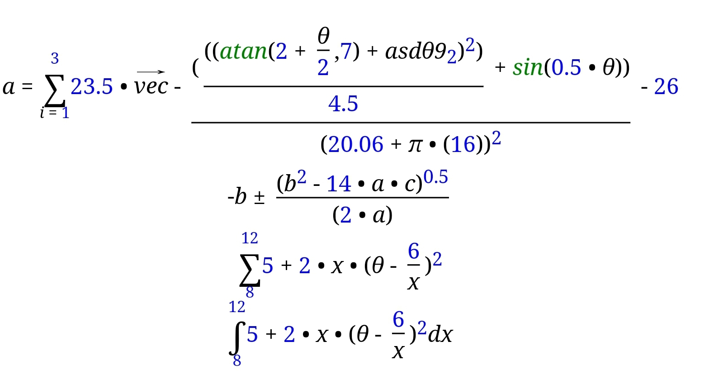

# Math-Expression-to-HTML
Produce html code from the mathematic expression string

## Check Demo
Visit following link and check demo in forum.
[Demo](https://edu.structsoftlab.com/forum/)

## Features
-
-
-
-

## Contact
Contact me for comercial use via mail winaungcho@gmail.com

