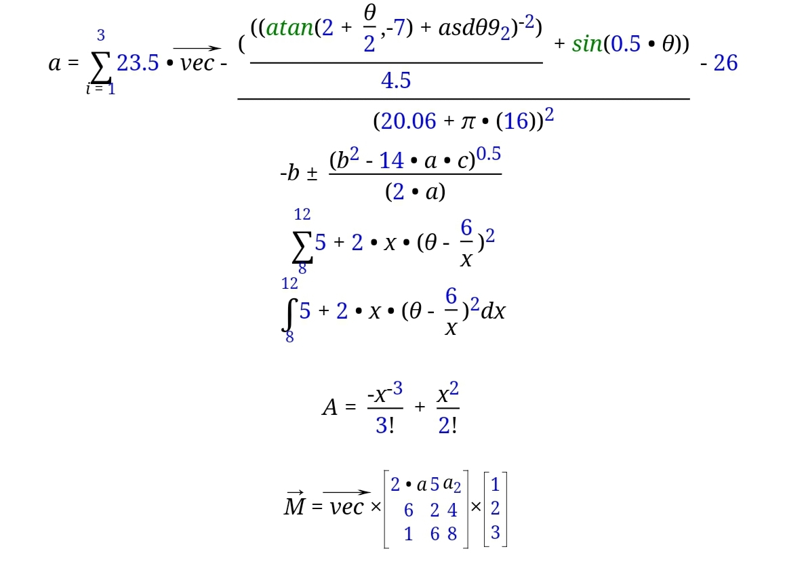

# Math-Expression-to-HTML
Produce html code from the mathematic expression string


## Demo Version
Visit following link and check demo in forum.
[Demo](https://edu.structsoftlab.com/forum/)

## Usage

First include the `mathexphtml.php` class in your file, and use the class as following to generate the HTML for the math expressions:

```php
$expression = "a=sum(i=1,3)(23.5*{vec}-(((cos(2+θ/2)+asd9)^2)/4.5+sin(0.5*θ))/(20.06+π*(16))^2-26)";

$parser = new mathExpHtml($expression);
$parser->printTokens();
echo $parser->getHtml();
```

## Features
Algorythm is very simple.

- String is tokenized using `preg_split` into array of tokens, 
- Token types are value, alpha-numeric and operator.
- Alpha numeric represents as a variable or function name.
- There are some known functions such as summation sign sum(i=1, 5).
- First tokens are simplify into simple expression inside the parenthesis.
- Nested parenthesis are allowed.
- Simple inside () are convert into html code using predefined css classes.
- Precedence are common as following order, ^, *,/,+.-.
- Multiple expressions of () may connected without operator eg., (3+a/4)(sin(0.5*θ))
- Vector variable can be used in written form enclosed with cali-bracket eg., {vec}

## Contact
Contact me for comercial use via mail winaungcho@gmail.com.

